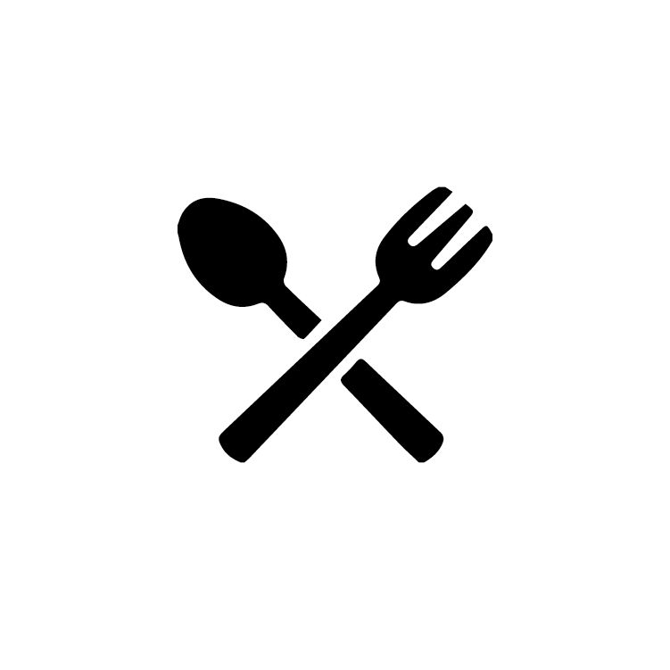

<!-- Improved compatibility of back to top link: See: https://github.com/othneildrew/Best-README-Template/pull/73 -->

<a id="readme-top"></a>

<!--
*** Thanks for checking out the Best-README-Template. If you have a suggestion
*** that would make this better, please fork the repo and create a pull request
*** or simply open an issue with the tag "enhancement".
*** Don't forget to give the project a star!
*** Thanks again! Now go create something AMAZING! :D
-->

<!-- PROJECT SHIELDS -->
<!--
*** I'm using markdown "reference style" links for readability.
*** Reference links are enclosed in brackets [ ] instead of parentheses ( ).
*** See the bottom of this document for the declaration of the reference variables
*** for contributors-url, forks-url, etc. This is an optional, concise syntax you may use.
*** https://www.markdownguide.org/basic-syntax/#reference-style-links
-->

[![Contributors][contributors-shield]][contributors-url]
[![Forks][forks-shield]][forks-url]
[![Stargazers][stars-shield]][stars-url]
[![Issues][issues-shield]][issues-url]
[![project_license][license-shield]][license-url]
[![LinkedIn][linkedin-shield]][linkedin-url]

<!-- PROJECT LOGO -->
<br />
<div align="center">
  <a href="https://github.com/ayemteezy/restaurant-page">
    
  </a>

<h3 align="center">Odin Restaurant Page</h3>

  <p align="center">
    A multi-page restaurant website built as part of The Odin Project curriculum (Full Stack JavaScript path). The focus of this project is dynamically building and rendering pages with JavaScript, without full page reloads, using Webpack to bundle everything into a single-page application.
    <br />
    <a href="https://github.com/ayemteezy/restaurant-page"><strong>Explore the docs »</strong></a>
    <br />
    <br />
    <a href="https://github.com/ayemteezy/restaurant-page">View Demo</a>
    &middot;
    <a href="https://github.com/ayemteezy/restaurant-page/issues/new?labels=bug&template=bug-report.md">Report Bug</a>
    &middot;
    <a href="https://github.com/ayemteezy/restaurant-page/issues/new?labels=enhancement&template=feature-request.md">Request Feature</a>
  </p>
</div>

<!-- TABLE OF CONTENTS -->
<details>
  <summary>Table of Contents</summary>
  <ol>
    <li>
      <a href="#about-the-project">About The Project</a>
      <ul>
        <li><a href="#built-with">Built With</a></li>
      </ul>
    </li>
    <li>
      <a href="#getting-started">Getting Started</a>
      <ul>
        <li><a href="#prerequisites">Prerequisites</a></li>
        <li><a href="#installation">Installation</a></li>
      </ul>
    </li>
    <li><a href="#usage">Usage</a></li>
    <li><a href="#project-structure">Project Structure</a></li>
    <li><a href="#roadmap">Roadmap</a></li>
    <li><a href="#contributing">Contributing</a></li>
    <li><a href="#license">License</a></li>
    <li><a href="#contact">Contact</a></li>
    <li><a href="#acknowledgments">Acknowledgments</a></li>
  </ol>
</details>

<!-- ABOUT THE PROJECT -->

## About The Project

[![Restaurant Page Screen Shot][product-screenshot]](https://example.com)

This project is part of [The Odin Project](https://www.theodinproject.com/lessons/node-path-javascript-restaurant-page)'s JavaScript course. The goal was to build a multi-page restaurant website that behaves like a single-page application — all pages are rendered dynamically with JavaScript and swapped in and out of the DOM without a full page reload, with Webpack handling bundling, asset optimization, and the production build.

The application features:

- A client-side router that renders Home, About, Menu, and Contact pages without reloading the browser
- A responsive navbar with active-link highlighting
- A hero section, featured highlights, and call-to-action on the homepage
- An About page covering restaurant philosophy, values, and team
- A full menu board listing dishes, descriptions, and prices
- A contact page with a validated reservation/inquiry form and restaurant info (hours, location, socials)
- A custom 404 / not-found page for unmatched routes
- CSS Modules for scoped, collision-free component styling
- Responsive, optimized images (auto-generated `.webp` variants) via `responsive-loader`
- Separate development and production Webpack configurations, with production builds minified, content-hashed, and split into vendor/runtime chunks

<p align="right">(<a href="#readme-top">back to top</a>)</p>

### Built With

- [![HTML5][HTML5]][HTML5-url]
- [![CSS3][CSS3]][CSS3-url]
- [![JavaScript][JavaScript]][JavaScript-url]
- [![Webpack][Webpack]][Webpack-url]

<p align="right">(<a href="#readme-top">back to top</a>)</p>

<!-- GETTING STARTED -->

## Getting Started

To get a local copy up and running, follow these steps.

### Prerequisites

- [Node.js](https://nodejs.org/) (LTS recommended)
- npm (comes bundled with Node.js)

### Installation

1. Clone the repo

```sh
   git clone https://github.com/ayemteezy/restaurant-page.git
```

2. Navigate into the project directory

```sh
   cd restaurant-page
```

3. Install dependencies

```sh
   npm install
```

<p align="right">(<a href="#readme-top">back to top</a>)</p>

<!-- USAGE EXAMPLES -->

## Usage

**Development**

Run the dev server with hot reloading:

```sh
npm run dev
```

Then open the local URL Webpack prints in your terminal.

**Production Build**

Bundle an optimized, minified build:

```sh
npm run build
```

This outputs static files to the `dist/` folder.

> **Note:** The built app uses client-side routing, which requires an HTTP server — you can't just open `dist/index.html` directly from the filesystem (`file://`), or navigation between pages won't work. To preview the production build locally, serve it with:
>
> ```sh
> npx serve dist
> ```

<p align="right">(<a href="#readme-top">back to top</a>)</p>

<!-- PROJECT STRUCTURE -->

## Project Structure

````text
restaurant-page/
├── .github/
│ └── ISSUE_TEMPLATE/ # Bug report / feature request templates
├── build/
│ ├── webpack.common.js # Shared Webpack config
│ ├── webpack.dev.js # Development config
│ └── webpack.prod.js # Production config
├── public/ # Static assets copied as-is (favicon, HTML template, etc.)
├── src/
│ ├── assets/ # Images, icons, fonts
│ ├── components/ # Shared UI components (navbar, footer, buttons, etc.)
│ ├── layout/ # App shell / layout wrapper
│ ├── pages/ # Route-level pages (home, about, menu, contact, error)
│ │ ├── home/
│ │ ├── about/
│ │ ├── menu/
│ │ ├── contact/
│ │ └── error/
│ ├── app.js # App bootstrap
│ ├── router.js # Client-side router
│ └── index.js # Entry point
├── .gitattributes
├── .gitignore
├── eslint.config.js
├── package.json
├── package-lock.json
└── README.md

```

<!-- ROADMAP -->

## Roadmap

- [x] Client-side router (no full page reloads)
- [x] Home, About, Menu, and Contact pages
- [x] Custom 404 / not-found page
- [x] CSS Modules for component-scoped styling
- [x] Responsive image optimization
- [x] Production build with minification and code splitting
- [ ] Responsive Design across devices

See the [open issues](https://github.com/ayemteezy/restaurant-page/issues) for a full list of proposed features (and known issues).

<p align="right">(<a href="#readme-top">back to top</a>)</p>

<!-- CONTRIBUTING -->

## Contributing

Contributions are what make the open source community such an amazing place to learn, inspire, and create. Any contributions you make are **greatly appreciated**.

If you have a suggestion that would make this better, please fork the repo and create a pull request. You can also simply open an issue with the tag "enhancement".
Don't forget to give the project a star! Thanks again!

1. Fork the Project
2. Create your Feature Branch (`git checkout -b feature/AmazingFeature`)
3. Commit your Changes (`git commit -m 'Add some AmazingFeature'`)
4. Push to the Branch (`git push origin feature/AmazingFeature`)
5. Open a Pull Request

<p align="right">(<a href="#readme-top">back to top</a>)</p>

### Top contributors:

<a href="https://github.com/ayemteezy/restaurant-page/graphs/contributors">
  
</a>

<!-- LICENSE -->

## License

Distributed under the MIT License. See `LICENSE.txt` for more information.

<p align="right">(<a href="#readme-top">back to top</a>)</p>

<!-- CONTACT -->

## Contact

- Twitter/X: [@ayemteezy\_](https://x.com/ayemteezy_)
- Email: [laurencelestercarino@gmail.com](mailto:laurencelestercarino@gmail.com)
- GitHub: [ayemteezy](https://github.com/ayemteezy)

Project Link: [https://github.com/ayemteezy/restaurant-page](https://github.com/ayemteezy/restaurant-page)

<p align="right">(<a href="#readme-top">back to top</a>)</p>

<!-- ACKNOWLEDGMENTS -->

## Acknowledgments

- [The Odin Project](https://www.theodinproject.com/) — for the project brief and curriculum
- [Google Fonts](https://fonts.google.com/) — for the typefaces used throughout the site
- [contrib.rocks](https://contrib.rocks) — contributor image generator

<p align="right">(<a href="#readme-top">back to top</a>)</p>

<!-- MARKDOWN LINKS & IMAGES -->
<!-- https://www.markdownguide.org/basic-syntax/#reference-style-links -->

[contributors-shield]: https://img.shields.io/github/contributors/ayemteezy/restaurant-page.svg?style=for-the-badge
[contributors-url]: https://github.com/ayemteezy/restaurant-page/graphs/contributors
[forks-shield]: https://img.shields.io/github/forks/ayemteezy/restaurant-page.svg?style=for-the-badge
[forks-url]: https://github.com/ayemteezy/restaurant-page/network/members
[stars-shield]: https://img.shields.io/github/stars/ayemteezy/restaurant-page.svg?style=for-the-badge
[stars-url]: https://github.com/ayemteezy/restaurant-page/stargazers
[issues-shield]: https://img.shields.io/github/issues/ayemteezy/restaurant-page.svg?style=for-the-badge
[issues-url]: https://github.com/ayemteezy/restaurant-page/issues
[license-shield]: https://img.shields.io/github/license/ayemteezy/restaurant-page.svg?style=for-the-badge
[license-url]: https://github.com/ayemteezy/restaurant-page/blob/main/LICENSE.txt
[linkedin-shield]: https://img.shields.io/badge/-LinkedIn-black.svg?style=for-the-badge&logo=linkedin&colorB=555
[linkedin-url]: https://www.linkedin.com/in/laurence-lester-cari%C3%B1o/
[product-screenshot]: src/assets/images/screenshot.png

<!-- Shields.io badges. You can a comprehensive list with many more badges at: https://github.com/inttter/md-badges -->

[HTML5]: https://img.shields.io/badge/HTML5-E34F26?style=for-the-badge&logo=html5&logoColor=white
[HTML5-url]: https://developer.mozilla.org/en-US/docs/Web/HTML
[CSS3]: https://img.shields.io/badge/css3-%23663399?style=for-the-badge&logo=css&logoColor=white
[CSS3-url]: https://developer.mozilla.org/en-US/docs/Web/CSS
[JavaScript]: https://img.shields.io/badge/javascript-%23F7DF1E?style=for-the-badge&logo=javascript&logoColor=black
[JavaScript-url]: https://developer.mozilla.org/en-US/docs/Web/JavaScript
[Webpack]: https://img.shields.io/badge/webpack-%238DD6F9.svg?style=for-the-badge&logo=webpack&logoColor=black
[Webpack-url]: https://webpack.js.org/
```
````
